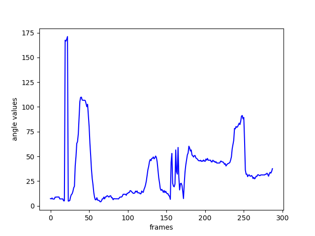

# Sport_position_tracking
A small application to track the athlete gesture and motion over time

**key sports**: running, taekwondo, cycling, triathlon

**Frameworks**: Mediapipe

**Features**: 
- angle tracking
- trajectory tracking
- AI-Trainer

<p float="center">
  
  
</p>

angle tracking:
<p float="center">
  
</p>

Clone the repo:
```bash
git clone https://github.com/furio1999/Sport_position_tracking.git
```

```bash
cd application
```
start the video application:
```bash
# Run on the webcam
python sport_pose.py --camera

# Run on video 
python sport_pose.py --video [PATH_TO_VIDEO] #eg. --video videos/tkd.mp4
```

activate the desired features
```bash
#perform trajectory tracking (taekwondo video)
python sport_pose.py --trajectory_tracking
```
choose the desired body part to track
```bash
python sport_pose.py --body_part [NAME_OF_PART]
#see the help section
```

help and explanation on a specific command
```bash
python sport_pose.py [COMMAND] -help
#es. --body_part -help
```
